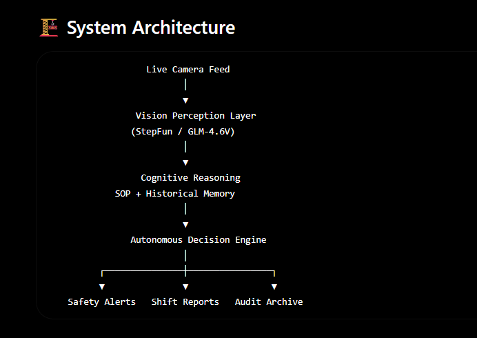

# IndustrialCell.AI

An autonomous, video-native AI supervisor for industrial production lines.
IndustrialCell.AI observes live factory operations, reasons over Standard Operating Procedures (SOPs) and historical context, and autonomously generates shift reports, safety alerts, and audit trails.

## 📖 Overview

IndustrialCell.AI was created to solve one of manufacturing's most persistent problems:

**Information Drift.**

During shift handovers, critical operational knowledge often disappears because it lives on clipboards, in notebooks, or simply in someone's memory. Missing information about machine vibration, safety compliance, or production anomalies can lead to downtime, quality issues, and costly mistakes.

IndustrialCell.AI acts as an AI Production Supervisor that continuously watches operations, reasons over factory rules, remembers previous shifts, and generates structured reports—without requiring manual intervention.

Instead of adding more cameras, IndustrialCell.AI gives the factory floor a brain.

## 🎯 Problem Statement

Traditional factory monitoring systems typically:
- Record video without understanding context
- Detect only predefined events
- Lose valuable information during shift changes
- Require engineers to manually review incidents
- Break when operating procedures change

IndustrialCell.AI replaces static rule engines with an agentic reasoning system capable of adapting to changing SOPs without rewriting code.

## ✨ Features
### 👁️ Watch — Vision Perception
The agent continuously observes production feeds and identifies:
- Operators
- Machine states
- Material movement
- Production activity
- Safety equipment
- PPE compliance
### 🧠 Reason — Cognitive Inference
Rather than relying on hardcoded logic, the AI reasons using:
- Dynamic Standard Operating Procedures (SOPs)
- Historical shift memory (10-shift context window)
- Current production observations
- Operational intent  
Example:
Changing the SOP from:
"Blue uniforms required."
to 
"White lab coats prohibited."
takes no code changes.
The AI immediately adapts its reasoning to enforce the updated policy.
### ⚡ Act & Report — Autonomous Execution  
IndustrialCell.AI automatically:
- Generates structured shift handover reports  
- Detects safety violations  
- Flags operational anomalies  
- Records machine observations  
- Produces immutable audit logs  
- Maintains historical production records  
## 🏗️ System Architecture  

# 🧰 Technology Stack

| Component | Technology |
| --- | --- |
| Core Engine | Python |
| Dashboard | Gradio |
| Vision Processing | OpenCV |
| Data Analytics | Pandas |
| AI Orchestration | ZenMux API |
| Vision Models | StepFun, GLM-4.6V |
| Storage | Custom StorageManager |

# 🧩 Core Components

## Cognition Layer

Powered by frontier multimodal vision-language models capable of converting raw pixels into operational reasoning.

Responsibilities include:
- Scene understanding
- Activity recognition
- SOP reasoning
- Safety inference
- Context-aware decision making

## Data Layer

A custom StorageManager provides:
- Persistent shift archives
- Historical memory retrieval
- Dynamic SOP loading
- UTF-8 safe storage
- Immutable audit logging

## Industrial OS Dashboard
Built with Gradio, featuring:
- Professional sidebar navigation
- Neural link status indicators
-
Shift management interface
-
Document management
-
Live reporting
-
Historical report browsing 
 
# 🔄 Workflow 

  
# 🚧 Challenges  
**💸 Zero API Budget**
IndustrialCell.AI was developed under a $0.00 API budget.
Challenges included:
freqent API rate limits,
the free-tier model restrictions,
and limited inference quotas.
Solution:
a Dynamic Model Fallback System automatically switches between available vision models whenever rate limits occur, ensuring uninterrupted operation.
  
# 🖥️ Windows Unicode Issues  
high-tech symbols and emoji generated by the AI caused file writing failures on Windows systems.
support:
the storage layer was redesigned to:
eUse UTF-8 encoding
to replace unsupported characters safely
to prevent corrupted shift archives.
this significantly improved deployment stability.
  
# 🏆 Achievements  
zero-shot SOP adaptability  
demonstrating true reasoning instead of hardcoding. during testing: original rule: blue uniforms required updated rule: white coats prohibited without modifying a single line of code, industrialcell.ai immediately identified the new safety violation in subsequent shifts. this validated that the system performs genuine contextual inference rather than static rule matching.
  
building industrialcell.ai reinforced several important principles: reasonings more robust than hardcoded logic; context dramatically improves decision quality; historical memory enables more human-like supervision; agentic ai can adapt to changing industrial environments with minimal engineering effort.
  # 🚀 Roadmap
 - IoT Integration
 - Synchronize live industrial sensor data including:
   - PLC signals
   - Vibration sensors
   - Temperature sensors
   - Power consumption
   - Equipment telemetry
 - Edge Deployment
   - Deploy vision inference directly on edge hardware for:
     - RTSP stream processing
     - Sub-second latency
     - Reduced cloud dependency
     - Increased reliability
   - Plant-Wide Multi-Agent System
     - Scale from supervising a single production cell to an entire manufacturing plant using a distributed "Plant-Wide Foremen" architecture.
     - Future capabilities include:
       - Multi-camera coordination
       - Cross-line reasoning
       - Factory-wide anomaly detection
       - Enterprise reporting
 # 🌟 Future Vision

IndustrialCell.AI aims to become an autonomous industrial operating system capable of supervising entire manufacturing facilities through intelligent perception, contextual reasoning, and continuous learning.

Our long-term goal is to transform factories from reactive environments into proactive, AI-assisted production ecosystems where every shift begins with complete operational awareness and every decision is backed by persistent institutional memory.

# 📜 License

This project is currently a prototype and is intended for research, experimentation, and future enterprise deployment. Licensing terms will be added as the project matures.
